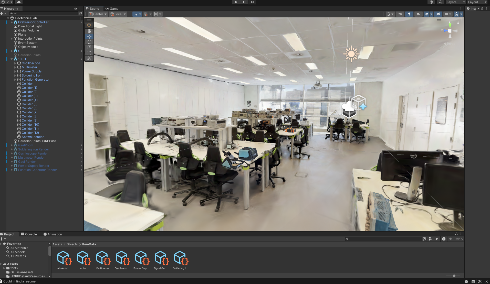
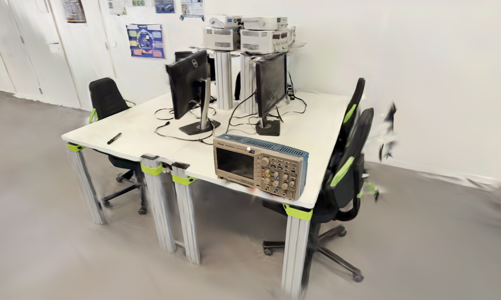
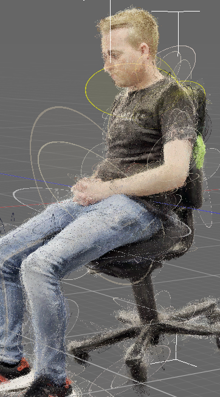
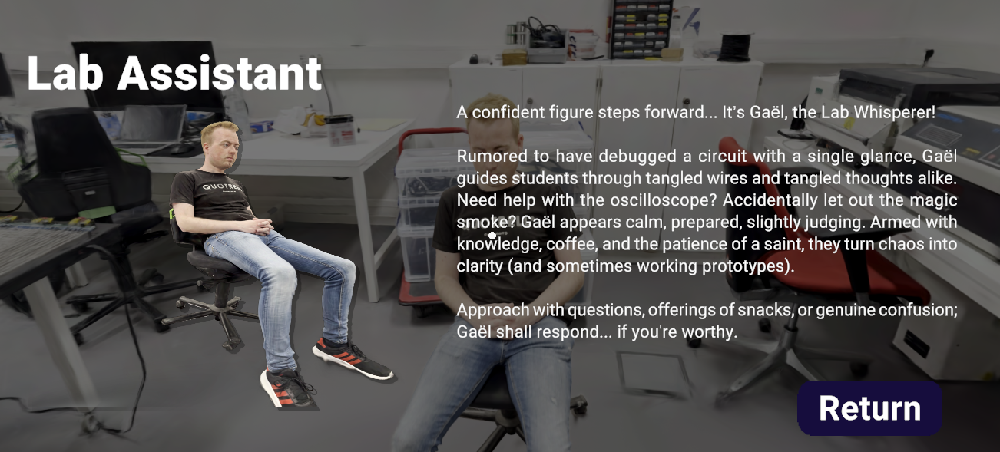
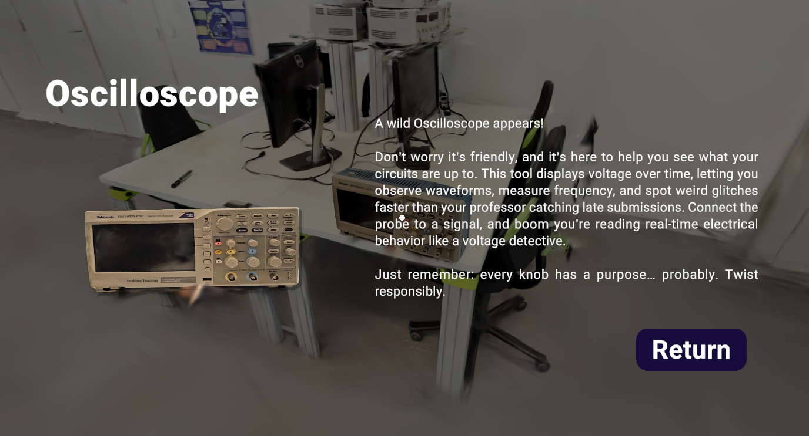
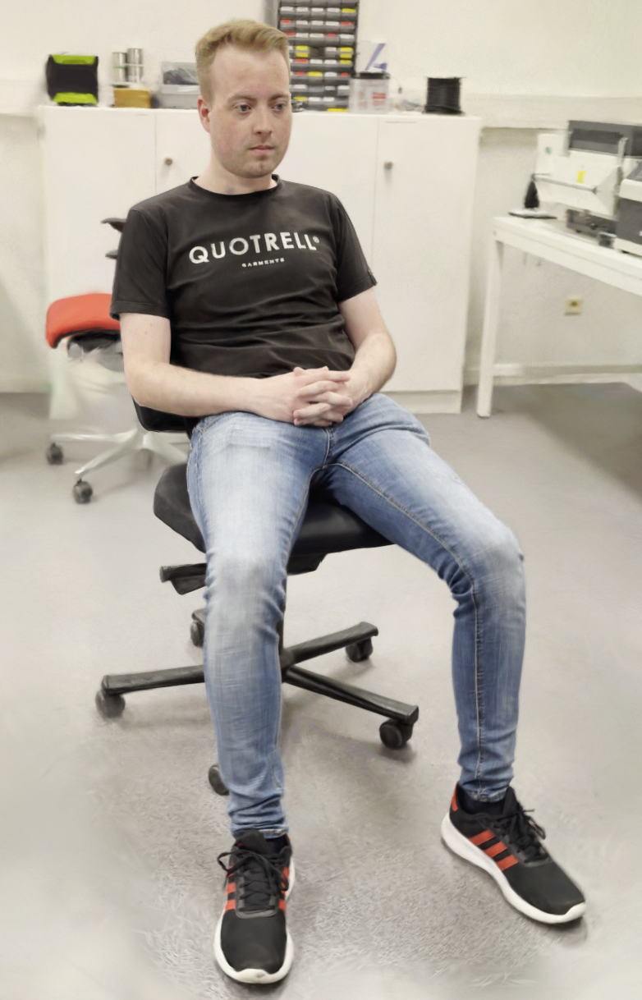

# gaussian_splat_tour
As part of the Extended Reality course in our Master's program, we created a virtual, interactive walking tour of the campus' electronics labs using Unity. 

The rooms and lab equipment were rendered using Gaussian Splatting for highly realistic visuals. Users can freely navigate in the different rooms, as well as interact with various objects to view an educational information screen.

